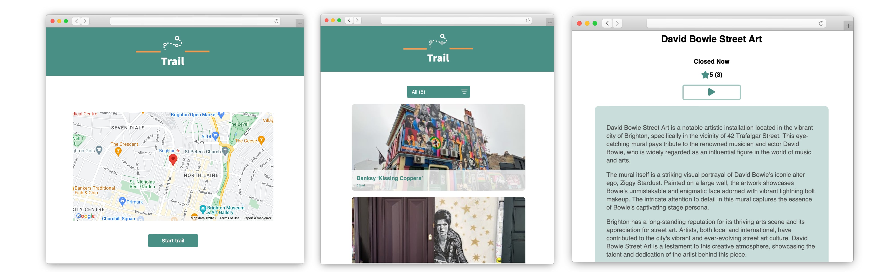

# Trail - Discover the World around you

Trail is an intuitive, user-friendly web application that helps users discover the top 5 historical sites near their location. Users can get detailed descriptions of each location, complete with text-to-speech functionality and step-by-step navigation. We leverage the Google Places API for location data, and OpenAI's GPT for generating engaging and informative descriptions. 

The application is live and can be accessed at [trailapp.net](https://trailapp.net).

## Screenshots



## Table of Contents

- [Installation](#installation)
- [Directory Structure](#directory-structure)
- [Usage](#usage)
- [Testing](#testing)
- [Contributing](#contributing)
- [License](#license)

## Installation

To run this project locally, follow the steps below:

1. Clone the repository:
    ```
    git clone https://github.com/joehannis/trail-public.git
    ```

2. Navigate into the `api` directory and install the necessary packages:
    ```
    cd trail/api/
    npm install
    ```

3. Then, navigate into the `frontend` directory and install the necessary packages:
    ```
    cd ../frontend/
    npm install
    ```

## Directory Structure

This project is organized into two main directories:

- `api/`: This directory contains the backend server logic written in Express. The `routes/`, `controllers/`, and `common/` folders can be found here. The `common/` folder contains all the required API call files.
- `frontend/`: This directory houses the React frontend. All the components used in the project are contained in the `src/` directory.

## Usage

To run the server:

1. Go to `api/bin/`:
    ```
    cd api/bin/
    ```

2. Run the following command:
    ```
    node www.js
    ```

To run the frontend:

1. Go to the `frontend` folder:
    ```
    cd ../../frontend/
    ```

2. Run the following command:
    ```
    npm run dev
    ```

Now, the app should be running on your specified local port.

## Testing

We use Jest for backend testing and Cypress for end-to-end testing on the frontend.

- To run backend tests, navigate to the `api` directory and run `jest`.
- To run frontend tests, navigate to the `frontend` directory and run `npm run cypress:run`.

## Contributing

Please see our [Contributing Guidelines](CONTRIBUTING.md) for more details.

## License

This project is licensed under the [MIT License](LICENSE.md).

## Acknowledgements

- [Google Places API](https://developers.google.com/maps/documentation/places/web-service/overview) for providing location data.
- [OpenAI GPT](https://openai.com/research/) for generating engaging descriptions.
